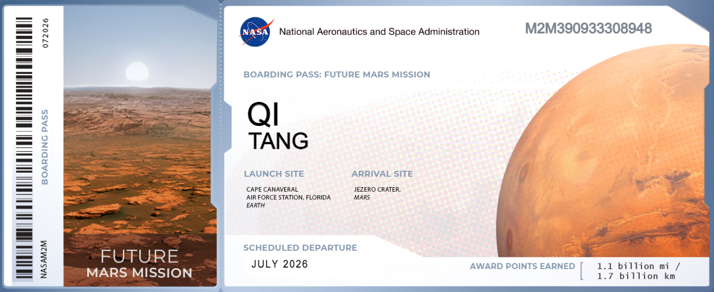

### Hi there <!--👋--> I'm Tang:

<!--
**Tang1705/Tang1705** is a ✨ _special_ ✨ repository because its `README.md` (this file) appears on your GitHub profile.

Here are some ideas to get you started:

- 🔭 I’m currently working on ...
- 🌱 I’m currently learning ...
- 👯 I’m looking to collaborate on ...
- 🤔 I’m looking for help with ...
- 💬 Ask me about ...
- 📫 How to reach me: ...
- 😄 Pronouns: ...
- ⚡ Fun fact: ...
-->

🎓 MPhil student at BJTU 
📝 Homepage Here: [Tang's Blog](https://www.tang5618.com/) 
📫 Mail: qitang@bjtu.edu.cn 
🏢 I’m currently serving for [XINCHECK](https://xincheck.com/) 

⭐️ From [Tang1705](https://github.com/Tang1705) 
<!-- -->
